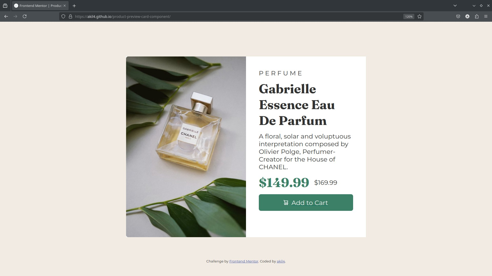

# Frontend Mentor - Product preview card component solution

This is a solution to the [Product preview card component challenge on Frontend Mentor](https://www.frontendmentor.io/challenges/product-preview-card-component-GO7UmttRfa).
## Table of contents

- [Overview](#overview)
  - [The challenge](#the-challenge)
  - [Screenshot](#screenshot)
  - [Links](#links)
- [My process](#my-process)
  - [Built with](#built-with)
  - [What I learned](#what-i-learned)
  - [Continued development](#continued-development)
  - [Useful resources](#useful-resources)
- [Author](#author)

## Overview

### The challenge

Users should be able to:

- View the optimal layout depending on their device's screen size
- See hover and focus states for interactive elements

### Screenshot



### Links

- Solution URL: [https://github.com/akil4/product-preview-card-component](https://github.com/akil4/product-preview-card-component)
- Live Site URL: [https://akil4.github.io/product-preview-card-component/](https://akil4.github.io/product-preview-card-component/)

## My process

### Built with

- **HTML**: Defines the structure of the card, including an image, text content, and a button.
- **CSS**: Styles the component with:
  - **Google Fonts** (Montserrat & Fraunces)
  - **Flexbox** for layout management
  - **Media queries** for responsiveness

### What I Learned

While working on this project, I improved my understanding of fundamental front-end development concepts. Here are some key learnings:

#### **1. Structuring HTML Semantically**
I learned to use semantic tags for better accessibility and maintainability.

```html
<h1>Gabrielle Essence Eau De Parfum</h1>
<p class="description">A floral, solar and voluptuous interpretation composed by Olivier Polge.</p>
```

#### **2. Using Flexbox for Layout**
I practiced CSS Flexbox to create a responsive layout efficiently.

```css
.container {
  display: flex;
  flex-wrap: wrap;
  background-color: white;
}

.text-container {
  padding: 1em;
}
```

#### **3. Styling Responsive Components**
I applied media queries to ensure the card adapts to different screen sizes.

```css
@media only screen and (min-width: 768px) {
  .container {
    width: 50%;
    margin: auto;
  }
}
```

#### **4. Enhancing User Experience with Hover Effects**
Adding a hover effect to the button improved the interactivity of the project.

```css
.add-to-cart:hover {
  background-color: hsl(200, 36%, 37%);
}
```

This project helped reinforce my front-end skills and made me more confident in structuring and styling components. 

### Continued development

In future projects, I want to continue refining and expanding my front-end skills in the following areas: 

#### **1. CSS Grid for More Complex Layouts**
While I used Flexbox for this project, I want to explore CSS Grid to create more advanced and flexible layouts.

#### **2. Performance Optimization**
I aim to improve page load speed by  optimizing images, reducing unnecessary CSS, and using better coding practices.

#### **3. Accessibility Best Practices**
Ensuring my projects are accessible to all users, including those with disabilities, by using proper ARIA attributes and testing with screen readers.

These focus areas will help me become well-rounded front-end developer and prepare me for full-stack development.

### Useful resources

- Google Fonts - Source for typography customization.

## Author

- Website - [Akil](https://akil4.vercel.app)
- Frontend Mentor - [@akil4](https://www.frontendmentor.io/profile/akil4)
- GitHub - [@akil4](https://www.github.com/akil4)
